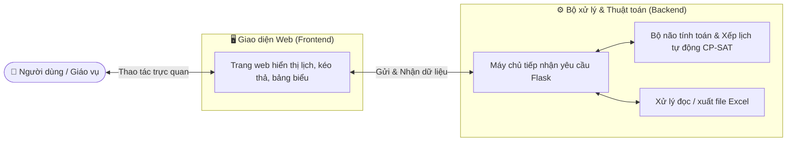

# 📅 VJU-Calendar — Hệ Thống Hỗ Trợ Xếp Thời Khóa Biểu Tự Động

> **Chào mừng bạn đến với dự án VJU-Calendar!**  
> Tài liệu này được biên soạn dành cho các thành viên mới trong đội ngũ phát triển, thầy cô giáo vụ và người dùng muốn tìm hiểu, vận hành hoặc tiếp tục hoàn thiện hệ thống xếp thời khóa biểu của Trường Đại học Việt Nhật (VJU).

---

## 🎯 1. Mục Tiêu Của Dự Án

Việc xếp thời khóa biểu thủ công cho hàng trăm lớp học phần mỗi kỳ luôn là một bài toán rất phức tạp và tốn nhiều thời gian. Giáo vụ phải cân đối rất nhiều điều kiện:
- **Giảng viên thỉnh giảng** chỉ rảnh vào một số khung giờ cố định.
- **Giảng viên cơ hữu** cần phân bổ lịch dạy hợp lý.
- **Sinh viên cùng một lớp/ngành** không thể học 2 môn cùng một lúc.
- **Phòng học** có giới hạn về số lượng, sức chứa và phân bố ở các cơ sở khác nhau.

**VJU-Calendar** ra đời nhằm:
1. **Tự động hóa tính toán:** Ứng dụng "bộ não" giải toán thông minh để tìm ra phương án xếp lịch tối ưu chỉ trong vài giây đến vài phút.
2. **Hỗ trợ điều phối linh hoạt (Bán tự động):** Cho phép giáo vụ dễ dàng kéo-thả, chỉnh sửa thủ công và hệ thống sẽ tự động cảnh báo nếu phát sinh trùng lịch.
3. **Tiết kiệm thời gian & Hạn chế sai sót:** Nhập dữ liệu trực tiếp từ file Excel kế hoạch giảng dạy và xuất ra bảng thời khóa biểu hoàn chỉnh, sẵn sàng sử dụng.

---

## 🏗️ 2. Cấu Trúc Hệ Thống (Dễ hiểu)

Hệ thống được chia thành 2 phần chính hoạt động phối hợp với nhau:



1. **Giao diện Web (Frontend - Thư mục `frontend/`):**
   - Là nơi người dùng thao tác trực tiếp: xem lưới lịch theo tuần, xem danh sách lớp, chọn giờ rảnh cho giảng viên, bấm nút tự động xếp lịch và kéo-thả để chỉnh sửa.
   - Giao diện được thiết kế hiện đại, mang tông màu đỏ đặc trưng của thương hiệu VJU.

2. **Bộ xử lý trung tâm (Backend - Thư mục `webapp/`):**
   - Nhận dữ liệu từ file Excel và lưu trữ trạng thái phiên làm việc.
   - Chứa **bộ não tính toán (Thuật toán CP-SAT)** để tự động giải quyết các ràng buộc phức tạp (không để trùng phòng, trùng giảng viên, trùng giờ sinh viên).
   - Xuất kết quả cuối cùng ra file Excel chuẩn định dạng.

---

## 🛠️ 3. Công Nghệ Sử Dụng

Dự án ưu tiên các công nghệ hiện đại, ổn định và dễ bảo trì:

| Thành phần | Công nghệ chính | Vai trò trong hệ thống |
|---|---|---|
| **Giao diện** | **React + Vite** | Giúp trang web phản hồi tức thì, mượt mà và trực quan. |
| **Kiểu dáng & Màu sắc** | **Tailwind CSS + shadcn/ui** | Tạo nên giao diện đẹp mắt, nhất quán theo phong cách nhận diện VJU. |
| **Máy chủ API** | **Python (Flask)** | Tiếp nhận các thao tác từ giao diện và điều phối các tác vụ. |
| **Bộ não giải toán** | **Google OR-Tools (CP-SAT)** | Thuật toán giải bài toán tối ưu hóa, tự động xếp lịch theo các quy tắc nghiệp vụ. |
| **Xử lý bảng tính** | **Pandas / OpenPyXL** | Đọc dữ liệu từ file Excel đầu vào và xuất file Excel kết quả. |

---

## 🔄 4. Quy Trình Hoạt Động Của Hệ Thống

Quy trình xếp lịch cơ bản trên hệ thống diễn ra qua 4 bước:

```
[Bước 1: Nạp dữ liệu] ──> Nhập file Excel kế hoạch giảng dạy vào hệ thống.
          │
          ▼
[Bước 2: Xếp Giai đoạn 1] ──> Tự động xếp lịch cho Giảng viên thỉnh giảng theo khung giờ họ đã đăng ký.
          │
          ▼
[Bước 3: Xếp Giai đoạn 2] ──> Tự động xếp tiếp Giảng viên cơ hữu & Gán phòng học phù hợp sức chứa.
          │
          ▼
[Bước 4: Tinh chỉnh & Xuất file] ──> Giáo vụ kiểm tra, kéo thả sửa tay nếu cần và xuất ra file Excel.
```

---

## 📂 5. Bản Đồ Thư Mục Dự Án

```text
VJU-Calendar/
├── config/                       # Cấu hình cục bộ (Git bỏ qua từng file)
│   ├── backend.json              # Tham số lịch học và solver của Flask
│   └── frontend.json             # Thiết lập proxy API cho Vite
├── frontend/                     # Giao diện React + Vite
│   ├── public/                   # Tài nguyên tĩnh
│   ├── src/
│   │   ├── adapters/             # Chuyển đổi và phân tích dữ liệu từ API
│   │   ├── components/           # Thành phần giao diện dùng chung
│   │   ├── constants/            # Hằng số của giao diện
│   │   ├── context/              # Trạng thái dùng chung của React
│   │   ├── hooks/                # React hooks
│   │   ├── lib/                  # Tiện ích frontend
│   │   ├── presentation/         # Trang, màn hình và thành phần nghiệp vụ
│   │   ├── services/             # Gọi API backend
│   │   ├── App.jsx               # Component gốc
│   │   └── main.jsx              # Điểm khởi tạo React
│   ├── package.json              # Dependencies và script npm
│   └── vite.config.js            # Đọc proxy từ config/frontend.json
├── webapp/                       # Backend Python Flask
│   ├── api/                      # Các endpoint HTTP
│   ├── domain/                   # Quy tắc và xử lý nghiệp vụ
│   ├── app.py                    # Điểm khởi động Flask
│   ├── app_config.py             # Đọc và kiểm tra config/backend.json
│   ├── scheduler_core.py         # Mô hình xếp lịch CP-SAT
│   ├── state.py                  # Trạng thái phiên làm việc
│   ├── snapshot.py               # Lưu và khôi phục dữ liệu nhập tay
│   ├── fate_import.py            # Đọc và chuẩn hóa Excel
│   ├── fate_export.py            # Xuất dữ liệu Excel
│   ├── fate_export_luoi.py       # Xuất lưới thời khóa biểu
│   ├── fate_audit.py             # Kiểm tra dữ liệu Excel
│   ├── fate_lecturers.py         # Đọc danh sách giảng viên
│   ├── kiem_tra_pham_vi.py       # Kiểm tra xếp lịch theo phạm vi
│   ├── kiem_tra_chuyen_di.py     # Kiểm tra tối ưu di chuyển
│   ├── kiem_tra_nhom_sinh_vien.py # Kiểm tra trùng lịch sinh viên
│   └── requirements.txt          # Dependencies Python
├── doc/                          # Tài liệu dự án
│   ├── PHAN-TICH-RANG-BUOC.md
│   ├── QUY-TRINH-NGHIEP-VU-XEP-TKB.md
│   ├── HUONG_DAN_SU_DUNG.docx
│   └── run.md                    # Hướng dẫn chạy và kiểm tra chuyên sâu
├── main.py                       # Khởi chạy cả backend và frontend
├── check_real_fate_data.py       # Công cụ kiểm tra dữ liệu thực
├── .gitignore                    # Danh sách file Git bỏ qua
└── README.md                     # Tài liệu tổng quan
```

---

## 🚀 6. Hướng Dẫn Khởi Chạy (Dành Cho Người Mới)

### Yêu cầu chuẩn bị
Trước khi bắt đầu, hãy đảm bảo máy tính của bạn đã cài đặt:
- **Python** (phiên bản 3.10 trở lên)
- **Node.js** (phiên bản 18 trở lên)

---

### Bước 1: Cài đặt thư viện (Chỉ cần làm lần đầu tiên)

Mở cửa sổ dòng lệnh (Terminal / Command Prompt / PowerShell) và chạy:

**1. Cài đặt thư viện Backend (Python):**
```bash
cd webapp
py -m pip install -r requirements.txt
```

**2. Cài đặt thư viện Frontend (Node.js):**
```bash
cd ../frontend
npm install
```

---

### Bước 2: Chuẩn bị hai file cấu hình

Hai file luôn nằm trong `config/` ở thư mục gốc dự án (không phụ thuộc vào thư mục bạn chạy lệnh), và đều bị Git bỏ qua:

- `config/backend.json`: quy tắc lịch học, số phòng, giới hạn ngày dạy, khối ca và tham số solver của backend. Nhận cấu hình phù hợp từ người cung cấp hệ thống hoặc tham khảo ví dụ an toàn bên dưới; không đưa dữ liệu nhạy cảm lên Git.
- `config/frontend.json`: địa chỉ backend mà Vite chuyển tiếp lời gọi API tới.

#### Cấu hình frontend (`config/frontend.json`)

```json
{
  "devServer": {
    "apiProxy": {
      "path": "/api",
      "target": "http://127.0.0.1:5055",
      "changeOrigin": true
    }
  }
}
```

Nếu chưa có một hoặc cả hai file cấu hình, khi chạy `py main.py`, chương trình sẽ tạo các file còn thiếu dưới dạng trống rồi dừng. Hãy điền nội dung theo hai ví dụ trong bước này và chạy lại. File cần đúng định dạng JSON; chương trình không ghi đè file đã có.

#### Cấu hình backend (`config/backend.json`)

```json
{
  "calendar": {
    "numDays": 7,
    "slotsPerDay": 13,
    "defaultDuration": 2,
    "maxImportedPeriod": 16,
    "dayLabels": [
      "Thứ 2",
      "Thứ 3",
      "Thứ 4",
      "Thứ 5",
      "Thứ 6",
      "Thứ 7",
      "Chủ nhật"
    ],
    "slotDayNames": [
      "Thu 2",
      "Thu 3",
      "Thu 4",
      "Thu 5",
      "Thu 6",
      "Thu 7",
      "Chu nhat"
    ]
  },
  "rooms": {
    "ltPool": 60,
    "labPool": 40
  },
  "teacherDayLimits": {
    "GUEST": 5,
    "RESIDENT": 4
  },
  "campuses": {
    "priority": [
      "hoa lac",
      "my dinh"
    ],
    "sessionBlocks": {
      "hoa lac": [
        [2, 5],
        [6, 13]
      ],
      "my dinh": [
        [1, 5],
        [6, 13]
      ]
    }
  },
  "solver": {
    "timeLimitSeconds": 30,
    "numSearchWorkers": 8,
    "crossProgramCombinationLimit": 5000
  },
  "legacyDataParams": {
    "seed": 0,
    "pctPreSubmitted": 100,
    "numForcedConflicts": 0
  },
  "availabilityGenerator": {
    "sessionBlocks": {
      "morning": {
        "startPeriod": 2,
        "endPeriod": 5,
        "selectionGroup": "daytime"
      },
      "afternoon": {
        "startPeriod": 6,
        "endPeriod": 9,
        "selectionGroup": "daytime"
      },
      "evening": {
        "startPeriod": 10,
        "endPeriod": 12,
        "selectionGroup": "evening"
      }
    },
    "selectionGroupWeights": {
      "daytime": 90,
      "evening": 10
    },
    "generationChanceByBlockStage": {
      "0": 100,
      "1": 35,
      "2": 10,
      "3OrMore": 0
    },
    "maxGeneratedBlocksPerDay": 1,
    "replaceExistingAvailability": true
  }
}

```

#### Giải thích các mục trong cấu hình backend

Cứ hình dung `config/backend.json` giống như **bảng "luật chơi"** mà cả hệ thống phải tuân theo. Dưới đây là ý nghĩa của từng dòng, giải thích theo kiểu dễ hiểu nhất có thể.

##### `calendar` — Lịch tuần trông như thế nào

| Tham số | Giá trị mẫu | Nói nôm na là... |
|---|---|---|
| `numDays` | `7` | Một tuần hiển thị trên lịch có 7 ngày (từ Thứ 2 đến Chủ nhật). |
| `slotsPerDay` | `13` | Mỗi ngày được chia nhỏ ra thành 13 "ô giờ" (gọi là **tiết**) để xếp lớp vào, giống như 1 ngày có 13 khung giờ trống trên thời khóa biểu. |
| `defaultDuration` | `2` | Nếu một lớp không ghi rõ học mấy tiết, hệ thống cứ mặc định coi là học 2 tiết một buổi. |
| `maxImportedPeriod` | `16` | Khi đọc file Excel, tiết học lớn nhất được chấp nhận là tiết 16 (phòng trường hợp có lớp học muộn) — cao hơn cả 13 để không bị báo lỗi "sai dữ liệu" một cách oan uổng. |
| `dayLabels` | `Thứ 2 → Chủ nhật` | Tên các ngày hiển thị cho người dùng xem trên giao diện. |
| `slotDayNames` | `Thu 2 → Chu nhat` | Tên ngày không dấu, dùng ở phía sau hậu trường (ghi log, xuất file) — người dùng bình thường không cần để ý mục này. |

##### `rooms` — Trường có bao nhiêu phòng học

| Tham số | Giá trị mẫu | Nói nôm na là... |
|---|---|---|
| `ltPool` | `60` | Cùng một lúc, trường có tối đa 60 phòng học lý thuyết (phòng học bình thường) có thể dùng. |
| `labPool` | `40` | Cùng một lúc, trường có tối đa 40 phòng thực hành/phòng máy có thể dùng. |

Hệ thống sẽ không bao giờ xếp nhiều lớp lý thuyết/thực hành hơn số phòng này diễn ra cùng một giờ.

##### `teacherDayLimits` — Giảng viên được dạy tới ngày nào trong tuần

| Tham số | Giá trị mẫu | Nói nôm na là... |
|---|---|---|
| `GUEST` | `5` | Giảng viên **thỉnh giảng** (mời từ ngoài trường) chỉ được máy tự xếp lịch tới hết ngày này. |
| `RESIDENT` | `4` | Giảng viên **cơ hữu** (biên chế của trường) chỉ được máy tự xếp lịch tới hết ngày này. |

Cách đếm hơi khác thói quen một chút: `0` là Thứ 2, `1` là Thứ 3, ... nên `5` = Thứ 7 và `4` = Thứ 6. Nói cách khác: thỉnh giảng có thể được xếp đến hết Thứ 7, còn cơ hữu chỉ đến hết Thứ 6 — không ai bị máy tự xếp vào Chủ nhật cả.

##### `campuses` — Quy tắc riêng theo từng cơ sở (Hòa Lạc / Mỹ Đình)

- `priority`: thứ tự cơ sở mà hệ thống **ưu tiên gom lịch gọn gàng hơn**. Ví dụ `["hoa lac", "my dinh"]` nghĩa là hệ thống cố gắng giảm số ngày một giảng viên phải chạy tới Hòa Lạc trước, rồi mới tính đến Mỹ Đình — vì Hòa Lạc thường xa hơn, đi lại vất vả hơn.
- `sessionBlocks`: mỗi cơ sở có "khối buổi học" riêng — tức là một buổi học không được phép bắt đầu ở buổi sáng rồi kết thúc lấn qua giờ nghỉ trưa. Ví dụ ở Hòa Lạc, buổi sáng là tiết `2` đến `5`, còn lại từ tiết `6` đến `13` được coi là buổi chiều/tối; một lớp 3 tiết có thể học tiết 2-4 hoặc 6-8, nhưng không thể học tiết 4-6 vì sẽ "vắt" qua giờ nghỉ trưa.

##### `solver` — Cài đặt cho "bộ tính toán tự động xếp lịch"

| Tham số | Giá trị mẫu | Nói nôm na là... |
|---|---|---|
| `timeLimitSeconds` | `30` | Mỗi lần bấm nút "Xếp lịch tự động", máy được cho tối đa 30 giây để suy nghĩ. Hết giờ mà chưa xong thì máy sẽ lấy phương án tốt nhất đã tìm được, không đứng chờ mãi. |
| `numSearchWorkers` | `8` | Cho máy tính "mượn" 8 luồng xử lý để cùng lúc thử nhiều cách xếp khác nhau, giống như nhờ 8 người cùng ngồi tính một bài toán để ra kết quả nhanh hơn. |
| `crossProgramCombinationLimit` | `5000` | Giới hạn số cặp lớp học được đem ra so sánh chéo giữa các chương trình đào tạo với nhau, để máy không bị "đơ" khi dữ liệu quá nhiều. |

##### `legacyDataParams` — Chỉ dùng khi tạo dữ liệu giả để thử nghiệm

Nhóm này **không ảnh hưởng đến dữ liệu thật**, chỉ có tác dụng khi lập trình viên tạo dữ liệu mẫu để kiểm tra hệ thống.

| Tham số | Giá trị mẫu | Nói nôm na là... |
|---|---|---|
| `seed` | `0` | Một "con số khởi đầu" để lần nào tạo dữ liệu giả cũng ra đúng y hệt kết quả cũ — giúp việc kiểm tra dễ so sánh hơn. |
| `pctPreSubmitted` | `100` | Trong dữ liệu giả, có bao nhiêu phần trăm giảng viên được coi như "đã khai báo sẵn giờ rảnh" (100 = tất cả). |
| `numForcedConflicts` | `0` | Cố tình tạo ra bao nhiêu vụ trùng lịch trong dữ liệu giả, để xem hệ thống có phát hiện và cảnh báo đúng không. |

##### `availabilityGenerator` — Tự động khai giờ rảnh cho giảng viên

Đây là phần cài đặt cho nút **"Tự động khai giờ rảnh"** ở màn hình sửa thông tin giảng viên: chỉ cần bấm 1 nút, hệ thống tự "đoán hộ" giảng viên rảnh vào những giờ nào trong tuần, thay vì phải tick tay từng ô trên lưới giờ. Áp dụng chung cho cả giảng viên thỉnh giảng lẫn cơ hữu.

- **`sessionBlocks`** — chia một ngày thành 3 "khung giờ lớn" để chọn: buổi sáng (`morning`, tiết 2-5), buổi chiều (`afternoon`, tiết 6-9), buổi tối (`evening`, tiết 10-12). Từ `selectionGroup` chỉ là cái tên nhóm để gộp sáng và chiều lại chung một rổ "ban ngày" (`daytime`) khi tính tỷ lệ ở bên dưới; buổi tối được xếp riêng vào rổ `evening`.
- **`selectionGroupWeights`** — tỷ lệ ưu tiên giữa "ban ngày" và "buổi tối" khi máy chọn ngẫu nhiên một khung giờ để gán làm giờ rảnh. `daytime: 90, evening: 10` nghĩa là cứ 100 lần chọn thì trung bình 90 lần rơi vào ban ngày (sáng hoặc chiều), chỉ 10 lần rơi vào buổi tối — máy sẽ ưu tiên gợi ý giờ rảnh vào ban ngày nhiều hơn hẳn buổi tối.
- **`generationChanceByBlockStage`** — cơ hội (tính theo %) để máy sinh thêm **một khung giờ rảnh nữa** trong cùng một ngày, tùy vào ngày đó giảng viên đã "kín" bao nhiêu khung rồi (kể cả giờ đang dạy sẵn):
  - `"0": 100` — ngày đó chưa dạy/chưa rảnh khung nào → chắc chắn 100% sẽ được gợi ý 1 khung rảnh.
  - `"1": 35` — ngày đó đã có 1 khung bận rồi → chỉ có 35% cơ hội máy gợi ý thêm 1 khung rảnh nữa.
  - `"2": 10` — đã có 2 khung bận → chỉ còn 10% cơ hội gợi ý thêm.
  - `"3OrMore": 0` — đã bận cả 3 khung (sáng, chiều, tối) → không gợi ý thêm gì nữa, vì cả ngày coi như kín lịch.
- **`maxGeneratedBlocksPerDay`** — mỗi ngày, nút "Tự động khai giờ rảnh" chỉ được phép tự thêm tối đa bao nhiêu khung giờ mới. Mặc định là `1` (mỗi ngày chỉ gợi ý thêm nhiều nhất 1 khung).
- **`replaceExistingAvailability`** — khi bấm nút tự động, hệ thống có xóa sạch giờ rảnh cũ để thay bằng kết quả mới hay không. Tham số này luôn phải để `true` (bắt buộc xóa và thay mới hoàn toàn); **giờ đang dạy thì không bao giờ bị đụng tới**, dù giá trị này là gì.

> 📝 **Nếu chưa quen đọc file cấu hình:** Bạn không cần hiểu hết ngay tất cả các dòng ở trên. Muốn dùng thử hệ thống, cứ giữ nguyên các giá trị mặc định — chúng đã được chọn sẵn để phù hợp với cách vận hành thực tế của VJU. Chỉ khi nào cần đổi số phòng, đổi giờ nghỉ trưa hay chỉnh tỷ lệ gợi ý giờ rảnh thì mới cần quay lại sửa đúng dòng liên quan.

> ℹ️ File cũ tạo trước khi có mục `availabilityGenerator` vẫn chạy được bình thường — hệ thống sẽ tự dùng các giá trị mặc định ở trên. Nhưng nếu bạn **đã** thêm mục này vào rồi mà gõ sai (ví dụ tổng `selectionGroupWeights` không bằng 100, hoặc để `replaceExistingAvailability: false`), hệ thống sẽ **dừng khởi động** và báo lỗi rõ ràng thay vì âm thầm bỏ qua, để tránh chạy nhầm với cấu hình sai.

Sau khi sửa một trong hai file cấu hình, hãy dừng chương trình và chạy lại để áp dụng thay đổi. Không đưa hai file cấu hình thật lên Git.

---

### Bước 3: Chạy chương trình

Sau bước 1, cửa sổ dòng lệnh đang ở thư mục `frontend/`. Chạy lệnh sau để trở về thư mục gốc và khởi động cả backend lẫn frontend:

```bash
cd ..
py main.py
```

Chương trình sẽ kiểm tra hai file cấu hình, cài thêm thư viện nếu còn thiếu, tạo lại `frontend/dist` rồi khởi chạy hệ thống. Có thể mở `http://127.0.0.1:5055` để dùng bản giao diện vừa build, hoặc mở đúng địa chỉ frontend do Vite hiển thị trong cửa sổ dòng lệnh (thường là `http://localhost:5173`) để phát triển với hot-reload. Không dùng lại một tiến trình `main.py` cũ sau khi kéo mã mới; hãy dừng và chạy lại để bản build được cập nhật. Khi muốn dừng, nhấn `Ctrl+C`.

---

## ✨ 7. Các Tính Năng Nổi Bật

1. **Lưới Thời Khóa Biểu Trực Quan:** Xem lịch học theo dạng tuần, lọc theo từng Giảng viên, từng Phòng học hoặc từng Chương trình đào tạo.
2. **Kéo - Thả Điều Chỉnh:** Cho phép giáo vụ di chuyển ca học trực tiếp trên lưới lịch.
3. **Cảnh Báo Xung Đột Tức Thì:** Tự động phát hiện và cảnh báo màu đỏ nếu phát sinh trùng giờ giảng viên hoặc trùng phòng.
4. **Xếp Lịch Linh Hoạt Theo Phạm Vi:** Có thể xếp lịch cho toàn trường hoặc xếp riêng cho từng Chương trình đào tạo / Khóa sinh viên.
5. **Hoàn Tác (Undo / Redo):** Dễ dàng quay lại trạng thái trước đó nếu lỡ thao tác nhầm.
6. **Kiểm Tra Lỗi File Excel:** Tự động chỉ ra các dòng dữ liệu bị thiếu hoặc trùng lặp mã lớp ngay khi tải file lên.

---

## 🤝 8. Hỗ Trợ & Đóng Góp

- Nếu gặp sự cố trong quá trình cài đặt hoặc vận hành, bạn có thể kiểm tra thêm tài liệu chi tiết tại:
  - `doc/run.md`: Hướng dẫn kỹ thuật và lệnh kiểm thử sâu.
  - `doc/QUY-TRINH-NGHIEP-VU-XEP-TKB.md`: Quy trình nghiệp vụ đào tạo chi tiết.
- Chúc bạn có trải nghiệm làm việc hiệu quả và thuận lợi cùng **VJU-Calendar**! 🎉